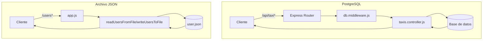

# Backend de Gestión de Taxis

Este proyecto es una API y backend para la gestión de taxis, desarrollada en Node.js.

## Estructura del proyecto

```
backend/
├── .env                  # Variables de entorno
├── package.json          # Dependencias y scripts de npm
├── taxi.sql              # Script SQL de base de datos
├── taxi2.sql             # Script SQL alternativo
├── public/               # Archivos públicos (HTML)
│   ├── apisT.html
│   └── index.html
└── src/
    ├── app.js            # Configuración principal de la app
    ├── index.js          # Punto de entrada
    ├── config/
    │   ├── config.js     # Configuración general
    │   └── db.js         # Configuración de la base de datos
    ├── controllers/
    │   └── taxis.controller.js  # Lógica de negocio de taxis
    ├── data/
    │   └── user.json     # Datos de usuarios
    ├── middleware/
    │   ├── db.middleware.js     # Middleware de base de datos
    │   ├── error.middleware.js  # Manejo de errores
    │   └── log.middleware.js    # Logs
    └── routes/
        └── taxis.routes.js      # Rutas de taxis
```

## Instalación

1. Clona el repositorio y entra a la carpeta `backend`:
   ```bash
   cd backend
   ```
2. Instala las dependencias:
   ```bash
   npm install
   ```
3. Configura el archivo `.env` con tus variables de entorno.
4. Ejecuta la aplicación:
   ```bash
   npm start
   ```

## Scripts útiles
- `npm start`: Inicia el servidor.
- `npm run dev`: Inicia el servidor en modo desarrollo (si está configurado).

## Notas
- Los archivos SQL (`taxi.sql`, `taxi2.sql`) contienen la estructura y datos de ejemplo para la base de datos.
- Los archivos en `public/` son accesibles como recursos estáticos.

## Autor
Proyecto de ejemplo para gestión de taxis.

---

## Flujo de datos: Base de datos real y archivo JSON

Este backend utiliza **dos fuentes de datos** para propósitos distintos:

### 1. Base de datos real (PostgreSQL)
Las rutas bajo `/api/taxi` (definidas en `src/routes/taxis.routes.js`) interactúan con una base de datos PostgreSQL real. El flujo es:

1. **El cliente realiza una petición** (GET, POST, PUT, DELETE) a `/api/taxi` o `/api/taxi/:placa`.
2. **El middleware `db.middleware.js`** inyecta la conexión a la base de datos en cada request (`req.db`).
3. **El controlador `taxis.controller.js`** ejecuta consultas SQL usando `req.db` para obtener, crear, actualizar o eliminar taxis en la tabla `taxi`.
4. **La respuesta** se envía al cliente con los datos actualizados desde la base de datos.

**Ejemplo de rutas:**
- `GET /api/taxi` — Lista taxis paginados desde PostgreSQL.
- `POST /api/taxi` — Crea un taxi en la base de datos.
- `PUT /api/taxi/:placa` — Actualiza un taxi por placa.
- `DELETE /api/taxi/:placa` — Elimina un taxi por placa.

### 2. Archivo local JSON (`user.json`)
Las rutas bajo `/users` (definidas directamente en `src/app.js`) gestionan usuarios de ejemplo almacenados en el archivo `src/data/user.json`. El flujo es:

1. **El cliente realiza una petición** (GET, POST, PUT, DELETE) a `/users` o `/users/:id`.
2. **Las funciones `readUsersFromFile` y `writeUsersToFile`** leen y escriben el archivo JSON localmente.
3. **No hay conexión a base de datos real** para estos endpoints; es solo persistencia en archivo para pruebas o ejemplos.
4. **La respuesta** se envía con los datos leídos o modificados en el archivo JSON.

**Ejemplo de rutas:**
- `GET /users` — Lista todos los usuarios del archivo JSON.
- `POST /users` — Agrega un usuario al archivo JSON.
- `PUT /users/:id` — Modifica un usuario en el archivo JSON.
- `DELETE /users/:id` — Elimina un usuario del archivo JSON.

### Resumen visual del flujo



---